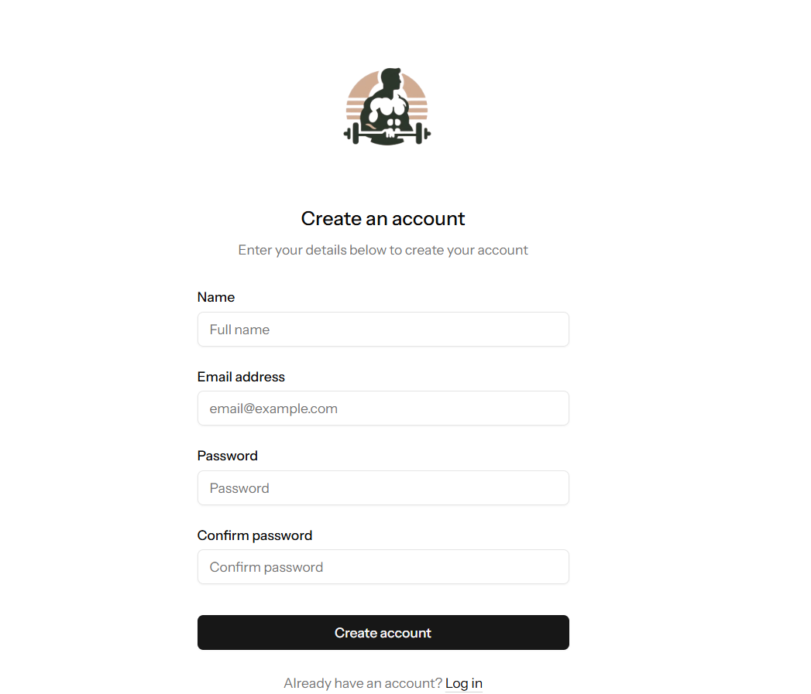
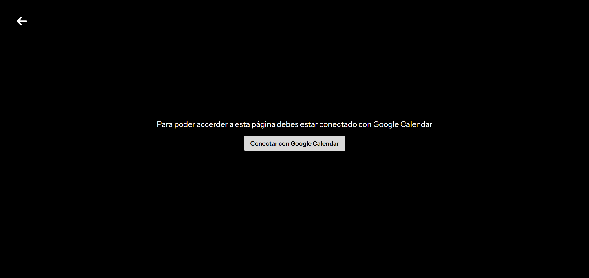
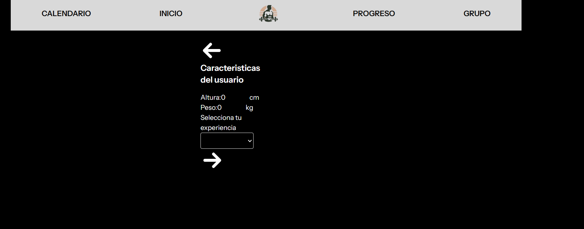
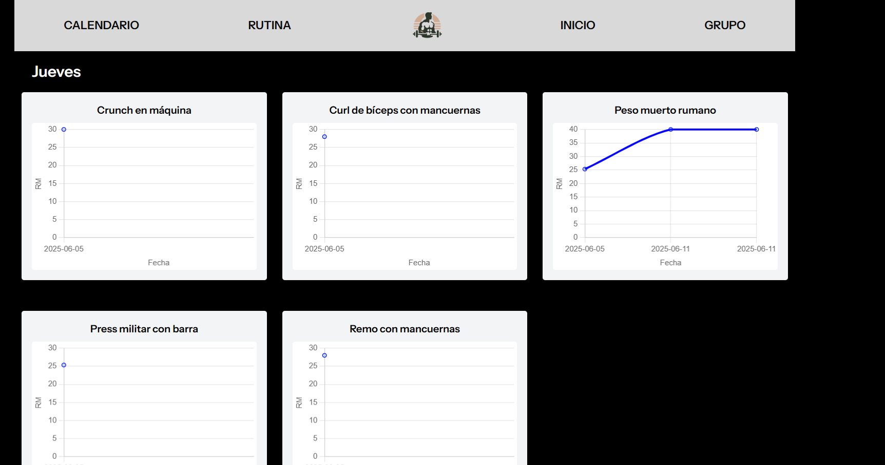
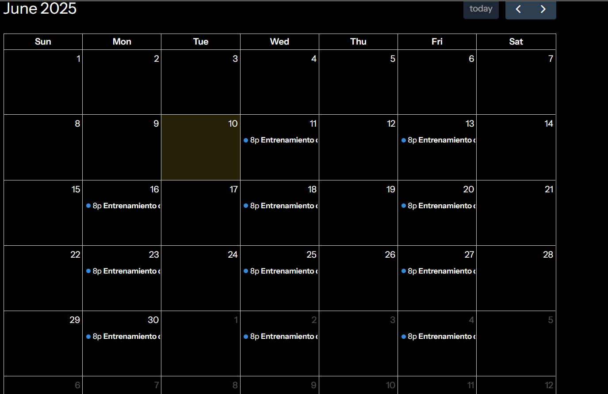

# TrainTime

Aplicación web para la gestión de rutinas de entrenamiento, registro de progresos y motivación en grupo, con integración de **OpenAI** para la generación de rutinas personalizadas y conexión a **Google Calendar** para la organización de la agenda del usuario.

---

## Índice

- [STACK TECNOLÓGICO](#stack-tecnológico)  
- [ACCESO A LA PLATAFORMA](#acceso-a-la-plataforma)  
- [CASOS DE USO](#casos-de-uso)  
- [AMPLIACIONES FUTURAS](#ampliaciones-futuras)  
- [CONCLUSIÓN](#conclusión)

---

## STACK TECNOLÓGICO

- **Backend:** Laravel 12 (PHP)  
- **Frontend:** Vue.js 3 + Inertia.js  
- **Base de datos:** MySQL  
- **Autenticación:** Laravel Breeze  
- **Integración IA:** OpenAI API (GPT)  
- **Calendar:** Google Calendar API (OAuth 2.0)  
- **Calendario:** FullCalendar  
- **Gráficas:** Chart.js / vue-chartjs  
- **Control de versiones:** Git  

---

## ACCESO A LA PLATAFORMA

- URL: [https://traintime.app](https://traintime.app) 
- Puedes registrarte con tu correo electrónico o iniciar sesión si ya tienes una cuenta.

---

## CASOS DE USO

### Registro y autenticación

Los usuarios pueden crear una cuenta mediante un formulario de registro.

 

---

### Conexión con Google Calendar

Desde el panel del usuario, es posible conectar la cuenta de Google. Esto permite que TrainTime cree eventos directamente en su calendario.
  

---

### Creación de rutinas

Los usuarios pueden poner todas sus especificaciones para que la IA cree su rutina ajustada a sus necesidades.

---

### Visualización de progresos

Los usuarios pueden ver todos los progresos de la rutina con Chart.js conforme vaya registrando los progresos
  

---

### Visualización de calendario

Los usuarios pueden ver el calendario de su rutina desde la página con FullCalendar.

---

## AMPLIACIONES FUTURAS

- Creación de una IA centrada en entrenamiento  
- Funcionalidad de la página de grupos
- Funcionalidad del footer
- Añadir nutrición con una IA específica de nutrición 
- Creación de IA específica de nutrición 
- Funcionalidad del FullCalendar para poder ver las descripciones de los entrenamientos.  
---

## CONCLUSIÓN

TrainTime es una aplicación innovadora, ya que la creación de la rutina la crea una IA según las especificaciones de cada usuario y los entrenamientos los registra en Google Calendar, que es una aplicación utilizada por multitud de personas para organizar su dia a dia.  Por lo que seria una aplicación que podría entrar bien en el mercado de aplicaciones de entrenamiento y aunque haya bastante competencia podría ser una aplicación importante debido a su innovación.

---

